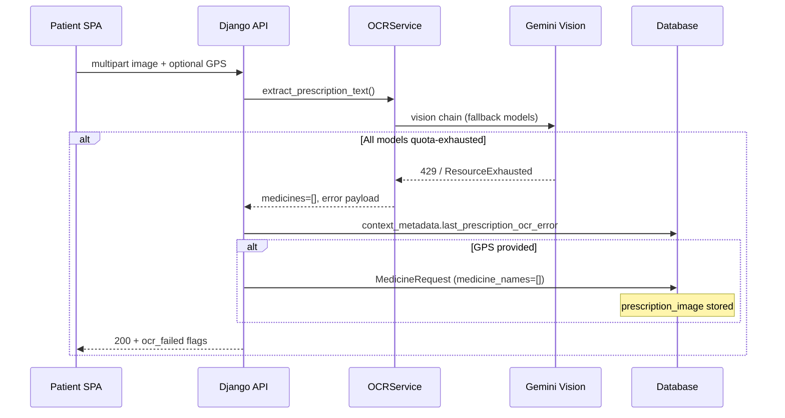
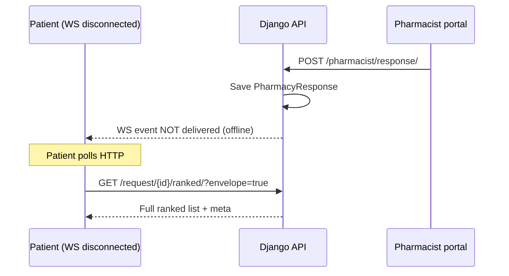

# Chapter 5 — Failure-Mode and Edge-Case Behaviour

**Purpose:** Paste into **Chapter 5 (Results & Discussion)** immediately after your module test tables. This section answers the examiner requirement that happy-path “Pass” rows be complemented by documented behaviour when external services fail, connections drop, uploads are invalid, or patients repeat actions.

**Scope:** MediConnect backend (`pharmacybackend` / `chatbot` app). Behaviour described matches the implemented code paths as of the capstone revision.

---

## 5.2.1 Introduction

Functional test tables (Login, Chat, Prescription upload, Broadcast, Reservation, etc.) verify that the system works when inputs are valid and dependencies are available. In production, **Gemini** may return HTTP 429 (quota), **WebSocket** clients may disconnect, users may upload **non-prescription images**, and patients may **tap “Reserve” twice**. The subsections below describe the **observable system response** (HTTP status, JSON fields, database state, and UI flags) for each failure class—not only that the test “failed.”

---

## 5.2.2 Gemini API timeout or quota exhaustion

### Design intent

MediBot and prescription OCR depend on Google Gemini (`GEMINI_API_KEY`). Outages must not corrupt patient data or block the pharmacy workflow: when automation fails, the platform **degrades to pharmacist manual review** while preserving the uploaded prescription image and broadcast lifecycle.

### Detection and retry (server-side)

| Mechanism | Location | Behaviour |
|-----------|----------|-----------|
| Quota / 429 detection | `gemini_exception_is_quota_or_rate_limit()` | Treats `ResourceExhausted`, message containing `429`, `quota exceeded`, `rate limit` as quota events |
| Vision model chain | `OCRService._vision_model_chain` | Tries primary model then `GEMINI_VISION_MODEL_FALLBACK` list before failing |
| Per-model retry | `_generate_vision()` | On transient rejection, advances to next model; surfaces last quota error if all exhausted |
| Client-friendly OCR error | `prescription_ocr_error_for_client()` | Returns `error_code: gemini_quota_rate_limit`, human-readable `error`, optional `retry_after_seconds` |
| Chat HTTP timeout | OpenRouter/Gemini REST calls | `timeout=30`–`45` seconds on outbound requests; timeout surfaces as generic processing error |

### Behaviour A — Symptom chat (`POST /api/chatbot/chat/`)

```mermaid
sequenceDiagram
    participant P as Patient SPA
    participant API as Django API
    participant G as Gemini API

    P->>API: POST /chat/ (message)
    API->>G: generateContent
    alt Quota / 429
        G-->>API: ResourceExhausted
        API-->>P: 200 + assistant text (quota message)
        Note over API: intent = error; no broadcast unless location flow continues separately
    else No API key at all
        API-->>P: 503 + setup_required
    end
```

| Condition | HTTP | Patient-visible outcome | Persistence |
|-----------|------|-------------------------|-------------|
| **No API key configured** (`get_chatbot_service()` is `None`) | **503 Service Unavailable** | `"Chatbot service is currently unavailable…"` + `setup_required: true` | User message may be stored; no AI reply |
| **Quota / rate limit during `process_message`** | **200 OK** (chat continues) | Assistant text: *"I'm currently experiencing high demand. The API quota may have been reached. Please try again in a few moments."* | `intent: error`; conversation metadata unchanged |
| **401 / 404 / invalid argument** | **200 OK** | Distinct short messages (auth issue, model unavailable, rephrase request) | Same |
| **Symptom keywords present + API down** | **200 OK** | **Rule-based fallback**: static symptom→medicine map may still return `suggested_medicines` with `fallback: true` | Patient can proceed without Gemini |

**Important:** Chat quota failure does **not** automatically create a `MedicineRequest`; the patient must still supply location and medicines through the normal flow (or prescription path).

### Behaviour B — Prescription OCR (`POST /api/chatbot/upload-prescription/`)



| Step | System action |
|------|----------------|
| 1 | Vision chain exhausts → `extract_prescription_text` catches exception → returns `medicines: []`, `confidence_percent: 0`, `error` / `error_code: gemini_quota_rate_limit` |
| 2 | `ChatMessage` logged; `conversation.context_metadata` updated: `prescription_pharmacist_read_pending: true`, `last_prescription_ocr_error` (truncated) |
| 3 | If **`location_latitude` and `location_longitude`** are posted: **`MedicineRequest` is still created** with empty `medicine_names`, **`prescription_image`** file saved, `prescription_review_snapshot` for pharmacists |
| 4 | JSON response includes: `ocr_failed: true`, `prescription_image_only: true`, `broadcasted_without_extracted_medicines: true` (when broadcast ran), human-readable `message` explaining pharmacies will read the photo |

**Example response fragment (quota, with location):**

```json
{
  "medicines": [],
  "confidence_percent": 0,
  "ocr_failed": true,
  "prescription_image_only": true,
  "medicine_request_id": "a1b2c3d4-…",
  "error": "Prescription OCR is temporarily unavailable: your Google Gemini project hit a rate limit…",
  "error_code": "gemini_quota_rate_limit",
  "message": "We could not read medicine names automatically, but your prescription image was sent to nearby pharmacies…"
}
```

### Behaviour C — Skip OCR (no further Gemini calls)

If the patient re-uploads with **`skip_ocr=true`** or **`pharmacist_review_only=true`**:

- Gemini is **not** invoked (`bypass_gemini` path).
- Image is stored and broadcast proceeds when GPS is present.
- Response: `skip_ocr: true`, `ocr_failed: true`, `prescription_image_only: true`.

### Behaviour D — Follow-up chat broadcast without OCR list

If the SPA posts **`POST /chat/`** with `prescription_image_only` + `ocr_failed` + location:

- Server forces a **prescription-type** `MedicineRequest` with **`medicines: []`** (image-first workflow).
- Pharmacist dashboard shows **`needs_pharmacist_prescription_read`** and **`prescription_image_url`**.

### Pharmacist and admin impact

| Role | Experience |
|------|------------|
| **Pharmacist** | Request appears in inbox; quotes from image via `GET …/prescription-image/` |
| **Patient** | Ranked view may show responses once pharmacists reply; no OCR-derived medicine list until manual entry |
| **Platform** | Admin analytics still count request; safety reviews unaffected |

### Suggested negative test row (Prescription module)

| Test ID | Scenario | Expected | Observed | Pass/Fail |
|---------|----------|----------|----------|-----------|
| Presc-N2 | Valid JPEG + GPS; Gemini key invalid or quota mocked | HTTP 200, `ocr_failed: true`, `medicine_request_id` present, pharmacies notified | *[fill at demo]* | |

---

## 5.2.3 Pharmacy WebSocket disconnection during broadcast

### Design intent

Live ranked updates use **Django Channels** (`ws/chatbot/<medicine_request_id>/`). WebSockets are an **optimisation**; **HTTP polling** remains the authoritative recovery path so a dropped mobile connection does not lose pharmacist quotes.

### Connection lifecycle

| Event | Server behaviour (`ChatbotConsumer`) |
|-------|-----------------------------------|
| **Connect** | Client joins group `chat_request_{uuid}`; `accept()` |
| **Disconnect** | `group_discard` — no buffered replay queue |
| **Inbound message** | Not used for patient recovery (server-push only) |

### Events pushed to subscribers

| `event` field | When fired | Payload |
|---------------|------------|---------|
| `medicine_request_snapshot` | After patient `/chat/` creates broadcast | `pharmacy_responses`, `drug_interactions`, optional `poll_url` |
| `medicine_request_ranked_update` | After pharmacist `POST …/response/` | Full merged ranked list (same builder as `GET …/ranked/`), `ranking_pending`, `merged_rank_source: same_as_GET_ranked` |
| `pharmacy_response` (legacy) | Same pharmacist POST | Minimal ping `{ event, medicine_request_id }` for older UIs |

### Failure scenario: patient offline during pharmacist reply



| Situation | System behaviour |
|-----------|------------------|
| Patient WS **disconnected** when broadcast fires | Events are sent to group; patient misses them; **no server-side retry** |
| Pharmacist submits quote | HTTP **201** success; DB row committed; WS broadcast attempted inside `try/except` |
| WS broadcast throws | `[WARNING] WebSocket … failed` logged; **pharmacist response still saved** |
| Patient reconnects later | New WS subscription receives **only new** events unless client refetches |
| **Recovery (required for UX)** | `GET /api/chatbot/request/<uuid>/ranked/?conversation_id=…&envelope=true` returns identical merge logic |

### Channel layer note (deployment)

Development uses **`InMemoryChannelLayer`** (single process). Production should use **Redis** so multiple Daphne workers share groups; without Redis, WS events may not cross workers—a further reason HTTP ranked GET is documented as source of truth.

### Suggested negative test row (Broadcast module)

| Test ID | Scenario | Expected | Observed | Pass/Fail |
|---------|----------|----------|----------|-----------|
| Req-N1 | Patient closes WS tab; pharmacist posts quote within 2 min | HTTP ranked shows new row; WS optional | *[fill]* | |

---

## 5.2.4 Invalid prescription image

Validation is **layered**: fast rejects at the API, semantic failure at OCR, operational fallback to pharmacists.

### Layer 1 — Transport and MIME validation

| Input problem | HTTP | JSON `error` | Gemini called? |
|---------------|------|--------------|----------------|
| No `prescription_image` field | **400** | `"No prescription image provided"` | No |
| `content_type` not starting with `image/` (e.g. PDF, Word, `.exe` renamed) | **400** | `"File must be an image"` | No |

### Layer 2 — Decode and vision processing

| Input problem | HTTP | System behaviour |
|---------------|------|------------------|
| Corrupted binary / not decodable as image | **500** or **200** with empty OCR | Exception handler: `"Error processing prescription: …"` **or** OCR returns empty list + `error` in body |
| Valid image but **not a prescription** (landscape, selfie, blank page) | **200** | Vision may return no parseable medicines → `medicines: []`, `confidence_percent: 0`, `reading_notes` / `error` explaining parse failure |
| Handwriting / glare / low resolution | **200** | Partial list or empty list; **image still stored** if GPS provided |

### Layer 3 — Broadcast and flags (when location supplied)

Even when OCR extracts **zero** medicine names:

| Field | Value | Meaning for SPA |
|-------|-------|-----------------|
| `prescription_image_only` | `true` | Do not expect structured line items from OCR |
| `ocr_failed` | `true` | Show manual-review messaging |
| `broadcasted_without_extracted_medicines` | `true` | Pharmacies received image-only request |
| `medicine_request_id` | UUID | Patient can track responses |

Pharmacist portal: **`needs_pharmacist_prescription_read`** when `medicine_names` is empty on linked request.

### Layer 4 — Proactive skip (user chooses no OCR)

| Client sends | Result |
|--------------|--------|
| `skip_ocr=true` | No vision API call; image stored; pharmacist manual read |

### Summary table for thesis

| Category | Example | HTTP | Patient message (typical) | Pharmacy receives request? |
|----------|---------|------|---------------------------|----------------------------|
| Unsupported format | `.pdf` upload | **400** | File must be an image | No |
| Corrupted file | Truncated JPEG | **500** or empty OCR | Processing error / try again | Only if partial save path runs |
| Non-medical image | Photo of a car | **200** | Could not extract medicines; add location to broadcast | Yes, if GPS sent (image-only) |
| Unreadable Rx | Smudged handwriting | **200** | Same + pharmacist will confirm from photo | Yes, if GPS sent |

### Suggested negative test rows (Prescription module)

| Test ID | Scenario | Expected | Observed | Pass/Fail |
|---------|----------|----------|----------|-----------|
| Presc-N1 | Upload PDF renamed `.jpg` with wrong MIME | **400** | *[fill]* | |
| Presc-N3 | Upload random non-Rx photo + GPS | **200**, empty medicines, broadcast with image | *[fill]* | |

---

## 5.2.5 Duplicate reservation attempts for the same medicine

### Design intent

Reservations **lock inventory** (`reserved_quantity` on `PharmacyInventory`) for two hours. Duplicate active reservations for the same patient context must not double-lock stock or create conflicting pickup records.

### Endpoint

`POST /api/chatbot/reserve/`

**Required body fields:** `pharmacy_id`, `medicine_name` (or derivable from `conversation_id` metadata), `quantity`, plus `conversation_id` / `session_id`, optionally `medicine_request_id` / `request_id`.

### Duplicate detection rule

Inside **`transaction.atomic()`** with **`select_for_update()`** on inventory:

An **active duplicate** exists when another `Reservation` matches:

| Field | Match rule |
|-------|------------|
| `pharmacy` | Same pharmacy |
| `medicine_name` | Same SKU (case-insensitive) |
| `status` | `pending` or `confirmed` |
| `expires_at` | Still in the future |
| Scope | Same **`medicine_request`** if `request_id` provided; else same **`conversation`** or **`session_id`** |

### Response on duplicate

| | First request | Second request (duplicate) |
|---|---------------|----------------------------|
| **HTTP** | **201 Created** | **409 Conflict** |
| **Body** | `success: true`, new `reservation_id` | `error` explaining active reservation exists **plus** existing `reservation_id`, `status`, `expires_at`, `quantity` |
| **Inventory** | `reserved_quantity` increased | **No change** (transaction rolls back duplicate create) |

**Example 409 body:**

```json
{
  "error": "An active reservation already exists for this pharmacy and medicine.",
  "reservation_id": "f47ac10b-58cc-4372-a567-0e02b2c3d479",
  "medicine_request_id": "…",
  "pharmacy_id": "ph-001",
  "pharmacy_name": "HealthFirst Pharmacy",
  "medicine_name": "Paracetamol 500mg",
  "quantity": 2,
  "status": "pending",
  "expires_at": "2026-05-31T14:30:00+00:00"
}
```

### Related non-duplicate failures (for completeness)

| Condition | HTTP | Message |
|-----------|------|---------|
| Unknown pharmacy | **404** | Pharmacy not found |
| Medicine not in inventory | **404** | Medicine not found at this pharmacy |
| Insufficient stock | **400** | `Only N available (you requested M)` |
| Request ID does not match session/conversation | **403** | Medicine request does not match conversation |

### Concurrency

Two simultaneous reserve POSTs from the same patient: **`select_for_update()`** on inventory and duplicate queryset ensures one succeeds (**201**) and the other receives **409** (or **400** if stock exhausted after first lock).

### Suggested negative test row (Reservation module)

| Test ID | Scenario | Expected | Observed | Pass/Fail |
|---------|----------|----------|----------|-----------|
| Res-N1 | Two identical reserve POSTs (same request, pharmacy, SKU) within 2 h | First **201**, second **409** with same `reservation_id` | *[fill]* | |

---

## 5.2.6 Cross-reference to happy-path tests

| Module table (Chapter 5) | Happy-path ID | Failure subsection |
|--------------------------|---------------|-------------------|
| AI chat / symptom search | Chat01 | §5.2.2 Behaviour A |
| Prescription upload OCR | Presc01 | §5.2.2 B–D, §5.2.4 |
| Broadcast / WebSocket | Request01 | §5.2.3 |
| Reservation lifecycle | Res01 | §5.2.5 |

---

## 5.2.7 Limitations acknowledged

1. **No automatic WS replay** — clients must poll after reconnect.  
2. **Rate limiting** on public chat/upload is documented as production hardening; capstone demo `.env` may not enforce DRF throttles.  
3. **At-rest encryption** of `MEDIA_ROOT` depends on deployment (volume encryption / object storage SSE), not application-layer AES in Django code.  
4. OCR **timeout** is bounded by HTTP client timeout to Gemini (~45s), not a separate patient-facing countdown timer.

---

*End of failure-mode section — paste into Chapter 5 after module test tables.*
